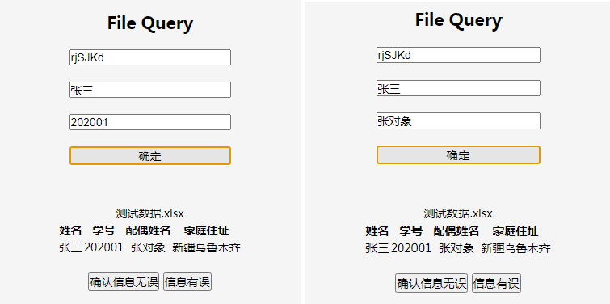
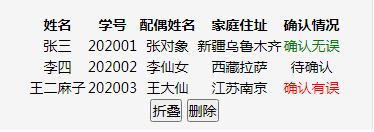
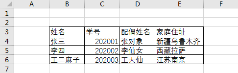
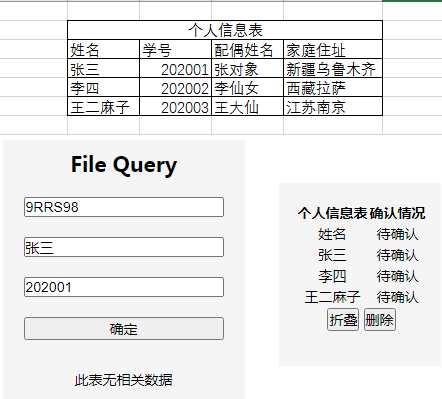

<<<<<<< HEAD
## 简介
使用githubpage+severless服务提供信息查询确认。
### 使用地址
https://boilerwarrior.github.io/FileQueryApp

测试账号:test, 密码:test
## 使用场景
班长A有一份或多份文档，包含班级中每个同学的个人信息，需要每个人确认相关信息是否有误，同时基本隐私考虑，每个人只能看到自己的信息。

此时A通过FileQueryApp上传文件，生成查询码，将查询码发给同学们。同学通过查询码和关键信息查询文件中的个人信息，并提交是否有误。班长可随时查看统计情况。
=======
# FileQueryApp

## 简介
使用githubpage+severless服务提供信息查询确认。
## 使用场景
班长A有一份或多份文档，包含班级中每个同学的个人信息，需要每个人确认相关信息是否有误，同时基本隐私考虑，每个人只能看到自己的信息。

此时班长A通过FileQueryApp上传文件，生成查询码，将查询码发给同学们。同学通过查询码和关键信息查询文件中的个人信息，并提交是否有误。班长可随时查看统计情况。
>>>>>>> 0e8aca2a9aedae39729aa5574ccfde6f05394478

## 功能及使用
### 创建查询
已登录用户上传文件（可一次上传多个文件），并点击设置查询截止时间和查询描述。将会自动生成查询码。

*注：未选择文件和截止时间无法上传文件。未设置查询描述则默认为default。*
### 查询
无需登录
<<<<<<< HEAD

根据查询码和文件表中的部分关键个人信息（名字+学号/身份证号...），若信息和查询码无误则服务端返回文件中对应的个人信息内容。
点击确认信息是否有误。

### 查询结果
登录用户点击查询当前账号下已经生成查询记录（一条记录对应一条查询码）。
点击查看对应的详细信息，包括文件内容，对应的确认情况。

## 注
* 上传文文件最好为.xlsx/.xlsx，不支持图片文件。
* 文件不要含有标题一类格式与信息内容不一致的内容。    
  - 正确示例

  - 错误示例：

=======
根据查询码和文件表中的部分关键个人信息（名字+学号/身份证号...），若信息和查询码无误则服务端返回文件中对应的个人信息内容。
点击确认信息是否有误。
### 查询结果
登录用户点击查询当前账号下已经生成查询记录（一条记录对应一条查询码）。
点击查看对应的详细信息，包括文件内容，对应的确认情况。
### 地址
https://boilerwarrior.github.io/FileQueryApp
## 注
上传文件为.xlsx/.xlsx，文件不要含有标题一类的格式与信息内容不一致的内容。
>>>>>>> 0e8aca2a9aedae39729aa5574ccfde6f05394478
